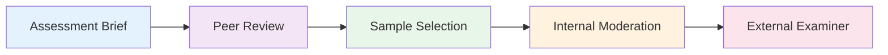
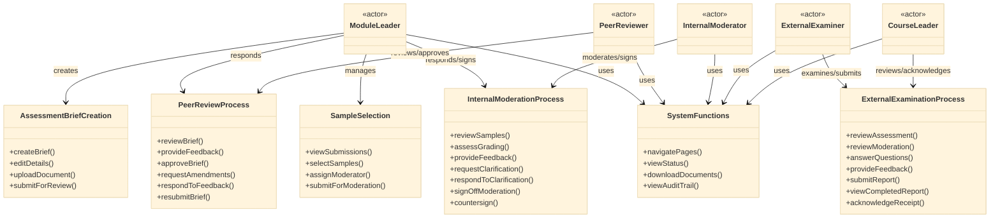

  # Assessment & Moderation Workflow

 This is a proposal prototype to streamline academic quality assurance through a multi-stage assessment moderation process. Guides module leaders, peer reviewers, internal moderators, and external examiners through assessment brief creation, peer review, sample selection, internal moderation, and external examination. Features role-based workflows, real-time collaboration tracking, sign-off mechanisms, and email notifications at key handoff points.

 
  [Link to Figma (static) Prototype](https://anime-boho-02334654.figma.site)

<!---
  This is a code bundle for Copy Design to Figma. The original project is available at https://www.figma.com/design/LopJqGSBbtyi6pGRIXJQWf/Copy-Design-to-Figma.

  ## Running the code

  Run `npm i` to install the dependencies.

  Run `npm run dev` to start the development server.

 --->
  

## Workflow Overview

The system implements a complete assessment lifecycle from brief creation through external examination, with multiple approval stages and feedback loops.

## Complete Workflow Flowchart

```mermaid
flowchart TD
    Start([Start: Module Leader]) --> A1[Page 1: Assessment Brief Creation]
    
    A1 --> A2{ML Submits<br/>Brief for<br/>Peer Review?}
    A2 -->|No| A1
    A2 -->|Yes| B1[Page 2: Peer Review]
    
    %% PEER REVIEW WORKFLOW
    B1 --> B2[View: Peer Reviewer View]
    B2 --> B3{Peer Reviewer<br/>Decision}
    
    B3 -->|Send Back for Amendment| B4[View: ML - Sent Back for Amendment]
    B4 --> B5[ML Reviews Peer Feedback]
    B5 --> B6[ML Makes Amendments]
    B6 --> B7[ML Resubmits]
    B7 --> B8[View: ML - Resubmitted]
    B8 --> B2
    
    B3 -->|Approve| B9[View: ML - Signed Off]
    B9 --> C1[Page 3: Sample Selection]
    
    %% SAMPLE SELECTION
    C1 --> C2[ML Selects Student Samples]
    C2 --> C3[ML Assigns Internal Moderator]
    C3 --> C4{ML Submits<br/>for Internal<br/>Moderation?}
    C4 -->|No| C1
    C4 -->|Yes| D1[Page 4: Internal Moderation]
    
    %% INTERNAL MODERATION WORKFLOW
    D1 --> D2[View: Internal Moderator View]
    D2 --> D3[IM Reviews Samples & Grading]
    D3 --> D4{IM Decision}
    
    D4 -->|Request Clarification| D5[IM Submits Questions]
    D5 --> D6[View: ML - Sent Back for Clarification]
    D6 --> D7[ML Provides Response]
    D7 --> D8{ML Submits<br/>Clarification?}
    D8 -->|No| D6
    D8 -->|Yes| D2
    
    D4 -->|Approve| D9[IM Signs Off]
    D9 --> D10[View: ML - Signed Off]
    D10 --> D11[ML Reviews & Signs Off]
    D11 --> E1[Page 5: External Examiner]
    
    %% EXTERNAL EXAMINER WORKFLOW
    E1 --> E2[View: External Examiner View]
    E2 --> E3[EE Reviews Student Samples]
    E3 --> E4[EE Reviews Internal Moderation]
    E4 --> E5[EE Answers Assessment Questions]
    E5 --> E6[EE Provides Feedback Comments]
    E6 --> E7{EE Completes<br/>& Submits<br/>Report?}
    E7 -->|No| E2
    E7 -->|Yes| E8[View: Course Leader - Completed Report]
    
    E8 --> E9[CL Reviews Complete Report]
    E9 --> E10[CL Downloads PDF]
    E10 --> E11{CL Acknowledges<br/>Receipt?}
    E11 -->|No| E8
    E11 -->|Yes| End([Assessment Workflow Complete])
    
    %% STYLING
    classDef briefStyle fill:#e3f2fd,stroke:#1976d2,stroke-width:2px
    classDef peerStyle fill:#f3e5f5,stroke:#7b1fa2,stroke-width:2px
    classDef sampleStyle fill:#e8f5e9,stroke:#388e3c,stroke-width:2px
    classDef moderationStyle fill:#fff3e0,stroke:#f57c00,stroke-width:2px
    classDef examinerStyle fill:#fce4ec,stroke:#c2185b,stroke-width:2px
    classDef decisionStyle fill:#fff9c4,stroke:#f57f17,stroke-width:3px
    classDef viewYellow fill:#fff9e6,stroke:#ff9800,stroke-width:2px
    classDef viewGreen fill:#e8f5e9,stroke:#4caf50,stroke-width:2px
    classDef viewBlue fill:#e3f2fd,stroke:#2196f3,stroke-width:2px
    
    class A1,A2 briefStyle
    class B1,B2,B3,B9 peerStyle
    class B4 viewYellow
    class B8 viewBlue
    class C1,C2,C3,C4 sampleStyle
    class D1,D2,D3,D4,D10,D11 moderationStyle
    class D6 viewYellow
    class E1,E2,E3,E4,E5,E6,E7,E8,E9,E10,E11 examinerStyle
    class A2,B3,C4,D4,D8,E7,E11 decisionStyle
```



## Detailed Workflow Stages

### **Stage 1: Assessment Brief Creation**
- **Actor:** Module Leader (ML)
- **Purpose:** Create and define the assessment
- **Key Actions:**
  - Fill in module information
  - Define assessment details
  - Upload assessment brief document
  - Submit for peer review

---

### **Stage 2: Peer Review** (4 Views)

#### **2.1 Peer Reviewer View**
- **Actor:** Peer Reviewer
- **Purpose:** Review assessment brief for quality and compliance
- **Key Actions:**
  - Review module information
  - Answer review questions
  - Provide feedback comments
  - **Decision:** Approve OR Send back for amendment

#### **2.2 ML: Sent Back for Amendment** (Yellow Theme)
- **Actor:** Module Leader
- **Purpose:** Address peer reviewer feedback
- **Key Actions:**
  - Read peer reviewer feedback
  - Make necessary amendments
  - Respond to comments
  - Resubmit amended brief

#### **2.3 ML: Resubmitted** (Blue Theme)
- **Actor:** Peer Reviewer (reviewing resubmission)
- **Purpose:** Review amended assessment brief
- **Key Actions:**
  - Review changes made by ML
  - Verify amendments address feedback
  - **Decision:** Approve OR Send back again

#### **2.4 ML: Signed Off** (Green Theme)
- **Actor:** Module Leader (viewing approval)
- **Purpose:** Proceed with approved assessment
- **Key Actions:**
  - View peer reviewer approval
  - Download approved brief
  - Proceed to sample selection

---

### **Stage 3: Sample Selection**
- **Actor:** Module Leader
- **Purpose:** Select student work samples for moderation
- **Key Actions:**
  - Review student submissions list
  - Select samples across grade ranges
  - Assign Internal Moderator
  - Submit for internal moderation

---

### **Stage 4: Internal Moderation** (3 Views)

#### **4.1 Internal Moderator View** (Blue Theme)
- **Actor:** Internal Moderator (IM)
- **Purpose:** Review grading consistency and standards
- **Key Actions:**
  - Review selected student samples
  - Assess grading appropriateness
  - Provide feedback on marking
  - **Decision:** Approve OR Request clarification

#### **4.2 ML: Sent Back for Clarification** (Yellow Theme)
- **Actor:** Module Leader
- **Purpose:** Respond to moderator questions
- **Key Actions:**
  - Read moderator's concerns/questions
  - Provide detailed clarification
  - Address grading issues
  - Resubmit response

#### **4.3 ML: Signed Off** (Green Theme)
- **Actor:** Module Leader & Internal Moderator
- **Purpose:** Final approval of moderation
- **Key Actions:**
  - IM reviews ML response
  - IM signs off approval
  - ML countersigns
  - Proceed to external examination

---

### **Stage 5: External Examiner** (2 Views)

#### **5.1 External Examiner View** (Purple Theme)
- **Actor:** External Examiner (EE)
- **Purpose:** Independent review of assessment standards
- **Key Actions:**
  - Review student sample work
  - Review internal moderation documentation
  - Answer assessment questions
  - Provide comprehensive feedback
  - Sign and submit report

#### **5.2 Course Leader: Completed Report** (Blue/Green Theme)
- **Actor:** Course Leader / Module Leader
- **Purpose:** Review and acknowledge completion
- **Key Actions:**
  - Review complete External Examiner report
  - View all submitted responses and feedback
  - Download complete PDF report
  - Acknowledge receipt
  - **Complete assessment workflow**

---

## Key Features Across All Workflows

### **Shared State Management**
- Central `AssessmentData` interface in App.tsx
- Data entered on any page updates all other pages
- Seamless information flow throughout workflow

### **Role-Based Views**
- **Module Leader:** Primary user, manages most stages
- **Peer Reviewer:** Quality assurance of assessment brief
- **Internal Moderator:** Reviews grading consistency
- **External Examiner:** Independent standards validation
- **Course Leader:** Final oversight and acknowledgment

### **Feedback Loops**
1. **Peer Review Loop:** Peer Reviewer ↔ Module Leader
2. **Internal Moderation Loop:** Internal Moderator ↔ Module Leader

### **Color Coding System**
- 🔵 **Blue:** Active working views (default state)
- 🟡 **Yellow:** Sent back for amendments/clarification
- 🟢 **Green:** Approved/signed off stages
- 🟣 **Purple:** External examiner activities

### **Document Trail**
- Assessment Brief document
- Peer review feedback
- Student work samples
- Internal moderation reports
- External examiner report
- Complete workflow PDF

---

## Navigation Between Pages



Users can navigate to any page via the navigation tabs, but the workflow is designed to progress sequentially from Assessment Brief → Peer Review → Sample Selection → Internal Moderation → External Examiner.

---

## Use Case Diagram

The following use case diagram illustrates the interactions between different actors and the system functionalities:

```mermaid
graph TB
    subgraph System["LMS Assessment Workflow System"]
        subgraph Brief["Assessment Brief Management"]
            UC1[Create Assessment Brief]
            UC2[Edit Assessment Details]
            UC3[Upload Brief Document]
            UC4[Submit for Peer Review]
        end
        
        subgraph PeerRev["Peer Review Management"]
            UC5[Review Assessment Brief]
            UC6[Provide Peer Feedback]
            UC7[Approve Assessment Brief]
            UC8[Request Amendments]
            UC9[Respond to Peer Feedback]
            UC10[Resubmit Amended Brief]
            UC11[View Peer Approval]
        end
        
        subgraph Sample["Sample Selection Management"]
            UC12[View Student Submissions]
            UC13[Select Student Samples]
            UC14[Assign Internal Moderator]
            UC15[Submit for Internal Moderation]
        end
        
        subgraph IntMod["Internal Moderation Management"]
            UC16[Review Student Samples]
            UC17[Assess Grading Standards]
            UC18[Provide Moderation Feedback]
            UC19[Request Clarification]
            UC20[Respond to Clarification Request]
            UC21[Sign Off Internal Moderation]
            UC22[Countersign Moderation]
        end
        
        subgraph ExtExam["External Examination Management"]
            UC23[Review Complete Assessment]
            UC24[Review Internal Moderation]
            UC25[Answer Assessment Questions]
            UC26[Provide External Feedback]
            UC27[Submit External Report]
            UC28[View Completed Report]
            UC29[Download Complete PDF]
            UC30[Acknowledge Report Receipt]
        end
        
        subgraph Common["Common Functions"]
            UC31[Navigate Between Pages]
            UC32[View Workflow Status]
            UC33[Download Documents]
            UC34[View Audit Trail]
        end
    end
    
    %% Actors
    ML[👤 Module Leader]
    PR[👤 Peer Reviewer]
    IM[👤 Internal Moderator]
    EE[👤 External Examiner]
    CL[👤 Course Leader]
    
    %% Module Leader connections
    ML -.->|performs| UC1
    ML -.->|performs| UC2
    ML -.->|performs| UC3
    ML -.->|performs| UC4
    ML -.->|performs| UC9
    ML -.->|performs| UC10
    ML -.->|performs| UC11
    ML -.->|performs| UC12
    ML -.->|performs| UC13
    ML -.->|performs| UC14
    ML -.->|performs| UC15
    ML -.->|performs| UC20
    ML -.->|performs| UC22
    ML -.->|performs| UC31
    ML -.->|performs| UC32
    ML -.->|performs| UC33
    ML -.->|performs| UC34
    
    %% Peer Reviewer connections
    PR -.->|performs| UC5
    PR -.->|performs| UC6
    PR -.->|performs| UC7
    PR -.->|performs| UC8
    PR -.->|performs| UC31
    PR -.->|performs| UC32
    
    %% Internal Moderator connections
    IM -.->|performs| UC16
    IM -.->|performs| UC17
    IM -.->|performs| UC18
    IM -.->|performs| UC19
    IM -.->|performs| UC21
    IM -.->|performs| UC31
    IM -.->|performs| UC32
    
    %% External Examiner connections
    EE -.->|performs| UC23
    EE -.->|performs| UC24
    EE -.->|performs| UC25
    EE -.->|performs| UC26
    EE -.->|performs| UC27
    EE -.->|performs| UC31
    EE -.->|performs| UC33
    
    %% Course Leader connections
    CL -.->|performs| UC28
    CL -.->|performs| UC29
    CL -.->|performs| UC30
    CL -.->|performs| UC31
    CL -.->|performs| UC32
    CL -.->|performs| UC34
    
    %% Styling
    classDef actor fill:#4a5568,stroke:#2d3748,stroke-width:3px,color:#fff
    classDef usecase fill:#e3f2fd,stroke:#1976d2,stroke-width:2px
    classDef system fill:#f5f5f5,stroke:#666,stroke-width:2px
    
    class ML,PR,IM,EE,CL actor
    class UC1,UC2,UC3,UC4,UC5,UC6,UC7,UC8,UC9,UC10,UC11,UC12,UC13,UC14,UC15,UC16,UC17,UC18,UC19,UC20,UC21,UC22,UC23,UC24,UC25,UC26,UC27,UC28,UC29,UC30,UC31,UC32,UC33,UC34 usecase
```



---

## Use Case Diagram - Alternative Format (UML Style)



---

## Actor Responsibilities Matrix

| Actor | Primary Responsibilities | Secondary Responsibilities |
|-------|-------------------------|---------------------------|
| **Module Leader** | • Create assessment brief<br>• Respond to peer feedback<br>• Select student samples<br>• Assign moderators<br>• Respond to moderation queries<br>• Countersign final moderation | • Navigate workflow<br>• Download documents<br>• View audit trail<br>• Track workflow status |
| **Peer Reviewer** | • Review assessment brief<br>• Provide constructive feedback<br>• Approve or request amendments<br>• Review resubmissions | • Navigate to peer review section<br>• View workflow status |
| **Internal Moderator** | • Review student samples<br>• Assess grading consistency<br>• Request clarifications<br>• Sign off moderation | • Navigate to moderation section<br>• View workflow status |
| **External Examiner** | • Review complete assessment<br>• Review internal moderation<br>• Answer assessment questions<br>• Provide comprehensive feedback<br>• Submit final report | • Download assessment documents<br>• Navigate workflow |
| **Course Leader** | • Review completed external report<br>• Download complete PDF<br>• Acknowledge receipt<br>• Complete workflow | • View audit trail<br>• Track overall workflow status |

---

## Use Case Descriptions

### **UC1: Create Assessment Brief**
- **Actor:** Module Leader
- **Description:** Module Leader creates a new assessment brief with all required module information
- **Precondition:** User is logged in as Module Leader
- **Postcondition:** Assessment brief is created and saved

### **UC5: Review Assessment Brief**
- **Actor:** Peer Reviewer
- **Description:** Peer Reviewer examines the assessment brief for quality and compliance
- **Precondition:** Assessment brief has been submitted for peer review
- **Postcondition:** Review feedback is recorded

### **UC7: Approve Assessment Brief**
- **Actor:** Peer Reviewer
- **Description:** Peer Reviewer approves the assessment brief, allowing progression to next stage
- **Precondition:** Peer review has been completed satisfactorily
- **Postcondition:** Assessment brief is marked as approved, ML can proceed to sample selection
- **Alternative Flow:** UC8 (Request Amendments)

### **UC13: Select Student Samples**
- **Actor:** Module Leader
- **Description:** Module Leader selects representative student work samples across grade ranges
- **Precondition:** Assessment brief is approved by peer reviewer
- **Postcondition:** Student samples are selected for internal moderation

### **UC16: Review Student Samples**
- **Actor:** Internal Moderator
- **Description:** Internal Moderator reviews selected samples and assesses grading standards
- **Precondition:** Samples have been submitted for internal moderation
- **Postcondition:** Moderation feedback is recorded

### **UC19: Request Clarification**
- **Actor:** Internal Moderator
- **Description:** Internal Moderator requests additional information or clarification from Module Leader
- **Precondition:** Moderation review reveals questions or concerns
- **Postcondition:** Clarification request is sent to Module Leader
- **Alternative Flow:** UC21 (Sign Off Internal Moderation)

### **UC23: Review Complete Assessment**
- **Actor:** External Examiner
- **Description:** External Examiner reviews all student samples and documentation
- **Precondition:** Internal moderation is complete and signed off
- **Postcondition:** External review is documented

### **UC27: Submit External Report**
- **Actor:** External Examiner
- **Description:** External Examiner submits comprehensive report on assessment standards
- **Precondition:** All review questions answered and feedback provided
- **Postcondition:** External report is submitted, Course Leader is notified

### **UC30: Acknowledge Report Receipt**
- **Actor:** Course Leader
- **Description:** Course Leader acknowledges receipt of external examiner report
- **Precondition:** External examiner has submitted report
- **Postcondition:** Assessment workflow is marked as complete

---

## System Interaction Patterns

### **Pattern 1: Feedback Loop (Peer Review)**
```
Module Leader → Submit Brief → Peer Reviewer → Request Amendments → 
Module Leader → Make Changes → Resubmit → Peer Reviewer → Approve
```

### **Pattern 2: Feedback Loop (Internal Moderation)**
```
Module Leader → Submit Samples → Internal Moderator → Request Clarification → 
Module Leader → Provide Response → Internal Moderator → Sign Off
```

### **Pattern 3: Linear Progression (Happy Path)**
```
Module Leader → Create Brief → Peer Reviewer → Approve → 
Module Leader → Select Samples → Internal Moderator → Sign Off → 
External Examiner → Submit Report → Course Leader → Acknowledge → Complete
```
