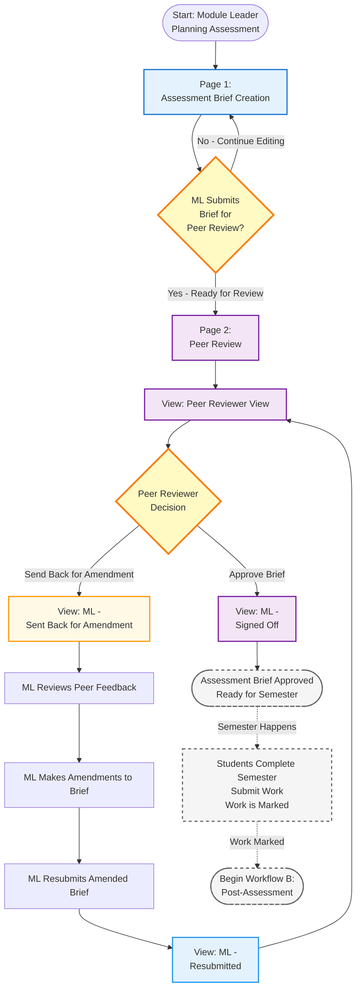
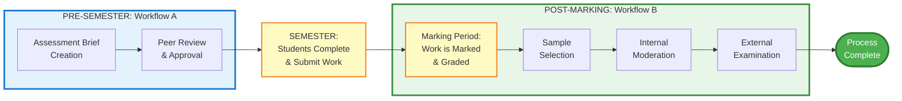

  # Assessment & Moderation Workflow

 This is a proposal prototype to streamline academic quality assurance through a multi-stage assessment moderation process. Guides module leaders, peer reviewers, internal moderators, and external examiners through assessment brief creation, peer review, sample selection, internal moderation, and external examination. Features role-based workflows, real-time collaboration tracking, sign-off mechanisms, and email notifications at key hand-off points.

 <div style="position: relative; width: 100%; height: 0; padding-bottom: 56.25%">
	<iframe src="https://solent.cloud.panopto.eu/Panopto/Pages/Embed.aspx?id=a59a40fb-aa6b-44bc-bd65-b3c900f10d16&autoplay=false&offerviewer=true&showtitle=true&showbrand=true&captions=true&interactivity=all" style="border: 1px solid #464646; position: absolute; top: 0; left: 0; width: 100%; height: 100%; box-sizing: border-box;" allowfullscreen allow="autoplay" aria-label="Panopto Embedded Video Player" aria-description="SOL Moderation Workflow"></iframe>
</div>

 <br>

  [Link to (static) Prototype](https://martinsolent.github.io/mod_prototype/)

  <br>

  [Workflow Overview](https://github.com/martinsolent/mod_prototype)

<!---
  This is a code bundle for Copy Design to Figma. The original project is available at https://www.figma.com/design/LopJqGSBbtyi6pGRIXJQWf/Copy-Design-to-Figma.

  ## Running the code

  Run `npm i` to install the dependencies.

  Run `npm run dev` to start the development server.

 --->
  

## LMS Assessment Workflow - Complete Process Flow

This document provides a comprehensive overview of the entire assessment workflow across all pages and views in the Learning Management System.

## Workflow Overview

The system implements **TWO DISTINCT WORKFLOWS** that occur at different points in the academic lifecycle:

### **Workflow A: Pre-Assessment (Before Student Work)**
Assessment Brief Creation → Peer Review → Approval

This workflow occurs **before students begin their work**. It ensures the assessment design is appropriate, meets academic standards, and is properly reviewed.

### **Workflow B: Post-Assessment (After Student Work is Marked)**
Sample Selection → Internal Moderation → External Examination

This workflow occurs **after students have completed the semester, submitted work, and had it marked**. It ensures marking consistency, grading standards, and academic quality assurance.

---

## Workflow A: Pre-Assessment Process (Assessment Design & Approval)

### Timeline
**Occurs: Before semester begins / Before students start work**

### Flowchart - Pre-Assessment Workflow



### Pre-Assessment Stages

#### **Stage 1: Assessment Brief Creation**
- **Actor:** Module Leader (ML)
- **Timing:** Before semester begins
- **Purpose:** Design and document the assessment
- **Key Actions:**
  - Fill in module information (code, title, level, etc.)
  - Define assessment type and requirements
  - Set learning outcomes
  - Upload assessment brief document
  - Submit for peer review

#### **Stage 2: Peer Review** (4 Views)

**2.1 Peer Reviewer View**
- **Actor:** Peer Reviewer
- **Timing:** After ML submits brief
- **Purpose:** Quality assurance of assessment design
- **Key Actions:**
  - Review assessment brief for appropriateness
  - Check alignment with learning outcomes
  - Verify academic standards
  - Answer review questions
  - **Decision:** Approve OR Send back for amendment

**2.2 ML: Sent Back for Amendment** (Yellow Theme)
- **Actor:** Module Leader
- **Timing:** If peer reviewer requests changes
- **Purpose:** Address peer reviewer concerns
- **Key Actions:**
  - Read peer reviewer feedback
  - Revise assessment brief
  - Make necessary amendments
  - Respond to comments
  - Resubmit amended brief

**2.3 ML: Resubmitted** (Blue Theme)
- **Actor:** Peer Reviewer (re-reviewing)
- **Timing:** After ML resubmits
- **Purpose:** Verify amendments address feedback
- **Key Actions:**
  - Review changes made by ML
  - Verify concerns addressed
  - **Decision:** Approve OR Send back again

**2.4 ML: Signed Off** (Green Theme)
- **Actor:** Module Leader (viewing approval)
- **Timing:** After peer approval
- **Purpose:** Confirmation and proceed with semester
- **Key Actions:**
  - View peer reviewer approval
  - Download approved brief
  - **Assessment is now approved for use in semester**

---

## Workflow B: Post-Assessment Process (Marking Quality Assurance)

### Timeline
**Occurs: After semester ends, work is submitted and marked**

### Flowchart - Post-Assessment Workflow

```mermaid
flowchart TD
    Start([Start: Semester Complete<br/>All Work Marked]) --> C1[Page 3:<br/>Sample Selection]
    
    %% SAMPLE SELECTION
    C1 --> C2[ML Reviews All Marked Work]
    C2 --> C3[ML Selects Student Samples<br/>Across Grade Range]
    C3 --> C4[ML Assigns Internal Moderator]
    C4 --> C5{ML Submits<br/>for Internal<br/>Moderation?}
    C5 -->|No - Continue Selecting| C1
    C5 -->|Yes - Ready for Moderation| D1[Page 4:<br/>Internal Moderation]
    
    %% INTERNAL MODERATION WORKFLOW
    D1 --> D2[View: Internal Moderator View]
    D2 --> D3[IM Reviews Sample Work & Marking]
    D3 --> D4{IM Decision}
    
    D4 -->|Request Clarification| D5[IM Submits Questions<br/>about Marking]
    D5 --> D6[View: ML -<br/>Sent Back for Clarification]
    D6 --> D7[ML Provides<br/>Clarification Response]
    D7 --> D8{ML Submits<br/>Clarification?}
    D8 -->|No - Continue Editing| D6
    D8 -->|Yes - Submitted| D2
    
    D4 -->|Approve Marking Standards| D9[IM Signs Off]
    D9 --> D10[View: ML -<br/>Signed Off]
    D10 --> D11[ML Reviews IM Approval]
    D11 --> D12[ML Countersigns]
    D12 --> E1[Page 5:<br/>External Examiner]
    
    %% EXTERNAL EXAMINER WORKFLOW
    E1 --> E2[View:<br/>External Examiner View]
    E2 --> E3[EE Reviews<br/>Student Sample Work]
    E3 --> E4[EE Reviews<br/>Marking & Feedback]
    E4 --> E5[EE Reviews<br/>Internal Moderation]
    E5 --> E6[EE Answers<br/>Assessment Questions]
    E6 --> E7[EE Provides<br/>Feedback Comments]
    E7 --> E8{EE Completes<br/>& Submits<br/>Report?}
    E8 -->|No - Continue Reviewing| E2
    E8 -->|Yes - Submit Report| E9[View: Module Leader -<br/>Completed Report]
    
    E9 --> E10[CL Reviews Complete Report]
    E10 --> E11[CL Downloads PDF]
    E11 --> E12{CL Acknowledges<br/>Receipt?}
    E12 -->|No - Continue Reviewing| E9
    E12 -->|Yes - Confirm| End([Assessment Process Complete<br/>Quality Assured])
    
    %% STYLING
    classDef sampleStyle fill:#e8f5e9,stroke:#388e3c,stroke-width:2px
    classDef moderationStyle fill:#fff3e0,stroke:#f57c00,stroke-width:2px
    classDef examinerStyle fill:#fce4ec,stroke:#c2185b,stroke-width:2px
    classDef decisionStyle fill:#fff9c4,stroke:#f57f17,stroke-width:3px
    classDef viewYellow fill:#fff9e6,stroke:#ff9800,stroke-width:2px
    classDef viewGreen fill:#e8f5e9,stroke:#4caf50,stroke-width:2px
    classDef pauseStyle fill:#f5f5f5,stroke:#666,stroke-width:2px,stroke-dasharray: 5 5
    
    class C1,C2,C3,C4,C5 sampleStyle
    class D1,D2,D3,D4,D10,D11,D12 moderationStyle
    class D6 viewYellow
    class E1,E2,E3,E4,E5,E6,E7,E8,E9,E10,E11,E12 examinerStyle
    class C5,D4,D8,E8,E12 decisionStyle
    class Start,End pauseStyle
```



### Post-Assessment Stages

#### **Stage 3: Sample Selection**
- **Actor:** Module Leader
- **Timing:** After all student work is marked
- **Purpose:** Select representative samples for quality review
- **Key Actions:**
  - Review complete list of student submissions
  - Select samples across grade ranges (high, middle, low, borderline)
  - Ensure representative sample of marking
  - Assign Internal Moderator
  - Submit for internal moderation

#### **Stage 4: Internal Moderation** (3 Views)

**4.1 Internal Moderator View** (Blue Theme)
- **Actor:** Internal Moderator (IM)
- **Timing:** After samples selected
- **Purpose:** Review marking consistency and standards
- **Key Actions:**
  - Review selected student work samples
  - Check marking against criteria
  - Assess grading appropriateness
  - Verify feedback quality
  - Provide feedback on marking
  - **Decision:** Approve OR Request clarification

**4.2 ML: Sent Back for Clarification** (Yellow Theme)
- **Actor:** Module Leader
- **Timing:** If IM has questions
- **Purpose:** Respond to moderator concerns about marking
- **Key Actions:**
  - Read moderator's questions about marking decisions
  - Provide detailed clarification on grading rationale
  - Address any grading inconsistencies
  - Explain borderline cases
  - Resubmit response

**4.3 ML: Signed Off** (Green Theme)
- **Actor:** Module Leader & Internal Moderator
- **Timing:** After IM satisfied with marking
- **Purpose:** Internal approval of marking standards
- **Key Actions:**
  - IM reviews ML clarification (if needed)
  - IM signs off internal moderation
  - ML countersigns approval
  - Proceed to external examination

#### **Stage 5: External Examiner** (2 Views)

**5.1 External Examiner View** (Purple Theme)
- **Actor:** External Examiner (EE)
- **Timing:** After internal moderation complete
- **Purpose:** Independent validation of academic standards
- **Key Actions:**
  - Review student sample work and grades
  - Review marking and feedback
  - Review internal moderation documentation
  - Compare standards to other UK institutions
  - Answer assessment questions
  - Provide comprehensive feedback
  - Sign and submit report

**5.2 Module Leader: Completed Report** (Blue/Green Theme)
- **Actor:** Module Leader
- **Timing:** After EE submits report
- **Purpose:** Final review and acknowledgment
- **Key Actions:**
  - Review complete External Examiner report
  - View all submitted responses and feedback
  - Download complete PDF report
  - Acknowledge receipt
  - **Complete post-assessment quality assurance**

---

## Complete Academic Cycle




---

## Use Case Diagram - Workflow A: Pre-Assessment

```mermaid
graph TB
    subgraph WorkflowA["Workflow A: Pre-Assessment Design & Approval"]
        subgraph Brief["Assessment Brief Management"]
            UC1[Create Assessment Brief]
            UC2[Edit Assessment Details]
            UC3[Upload Brief Document]
            UC4[Submit for Peer Review]
        end
        
        subgraph PeerRev["Peer Review Management"]
            UC5[Review Assessment Brief]
            UC6[Provide Peer Feedback]
            UC7[Approve Assessment Brief]
            UC8[Request Amendments]
            UC9[Respond to Peer Feedback]
            UC10[Resubmit Amended Brief]
            UC11[View Peer Approval]
        end
    end
    
    %% Actors for Workflow A
    ML_A[👤 Module Leader<br/>Pre-Assessment]
    PR[👤 Peer Reviewer]
    
    %% Module Leader connections - Workflow A
    ML_A -.->|performs| UC1
    ML_A -.->|performs| UC2
    ML_A -.->|performs| UC3
    ML_A -.->|performs| UC4
    ML_A -.->|performs| UC9
    ML_A -.->|performs| UC10
    ML_A -.->|performs| UC11
    
    %% Peer Reviewer connections
    PR -.->|performs| UC5
    PR -.->|performs| UC6
    PR -.->|performs| UC7
    PR -.->|performs| UC8
    
    %% Styling
    classDef actor fill:#4a5568,stroke:#2d3748,stroke-width:3px,color:#fff
    classDef usecase fill:#e3f2fd,stroke:#1976d2,stroke-width:2px
    
    class ML_A,PR actor
    class UC1,UC2,UC3,UC4,UC5,UC6,UC7,UC8,UC9,UC10,UC11 usecase
```



---

## Use Case Diagram - Workflow B: Post-Assessment

```mermaid
graph TB
    subgraph WorkflowB["Workflow B: Post-Assessment Quality Assurance"]
        subgraph Sample["Sample Selection Management"]
            UC12[View Marked Submissions]
            UC13[Select Student Samples]
            UC14[Assign Internal Moderator]
            UC15[Submit for Internal Moderation]
        end
        
        subgraph IntMod["Internal Moderation Management"]
            UC16[Review Student Samples]
            UC17[Assess Marking Standards]
            UC18[Provide Moderation Feedback]
            UC19[Request Clarification]
            UC20[Respond to Clarification Request]
            UC21[Sign Off Internal Moderation]
            UC22[Countersign Moderation]
        end
        
        subgraph ExtExam["External Examination Management"]
            UC23[Review Marked Work]
            UC24[Review Internal Moderation]
            UC25[Answer Assessment Questions]
            UC26[Provide External Feedback]
            UC27[Submit External Report]
            UC28[View Completed Report]
            UC29[Download Complete PDF]
            UC30[Acknowledge Report Receipt]
        end
        
        subgraph Common["Common Functions"]
            UC31[Navigate Between Pages]
            UC32[View Workflow Status]
            UC33[Download Documents]
            UC34[View Audit Trail]
        end
    end
    
    %% Actors for Workflow B
    ML_B[👤 Module Leader<br/>Post-Assessment]
    IM[👤 Internal Moderator]
    EE[👤 External Examiner]
    ML[👤 Module Leader]
    
    %% Module Leader connections - Workflow B
    ML_B -.->|performs| UC12
    ML_B -.->|performs| UC13
    ML_B -.->|performs| UC14
    ML_B -.->|performs| UC15
    ML_B -.->|performs| UC20
    ML_B -.->|performs| UC22
    ML_B -.->|performs| UC31
    ML_B -.->|performs| UC32
    ML_B -.->|performs| UC33
    ML_B -.->|performs| UC34
    
    %% Internal Moderator connections
    IM -.->|performs| UC16
    IM -.->|performs| UC17
    IM -.->|performs| UC18
    IM -.->|performs| UC19
    IM -.->|performs| UC21
    IM -.->|performs| UC31
    IM -.->|performs| UC32
    
    %% External Examiner connections
    EE -.->|performs| UC23
    EE -.->|performs| UC24
    EE -.->|performs| UC25
    EE -.->|performs| UC26
    EE -.->|performs| UC27
    EE -.->|performs| UC31
    EE -.->|performs| UC33
    
    %% Module Leader connections
    CL -.->|performs| UC28
    CL -.->|performs| UC29
    CL -.->|performs| UC30
    CL -.->|performs| UC31
    CL -.->|performs| UC32
    CL -.->|performs| UC34
    
    %% Styling
    classDef actor fill:#4a5568,stroke:#2d3748,stroke-width:3px,color:#fff
    classDef usecase fill:#e8f5e9,stroke:#388e3c,stroke-width:2px
    
    class ML_B,IM,EE,CL actor
    class UC12,UC13,UC14,UC15,UC16,UC17,UC18,UC19,UC20,UC21,UC22,UC23,UC24,UC25,UC26,UC27,UC28,UC29,UC30,UC31,UC32,UC33,UC34 usecase
```



---

## Actor Roles Across Both Workflows

| Actor | Workflow A: Pre-Assessment | Workflow B: Post-Assessment |
|-------|---------------------------|----------------------------|
| **Module Leader** | • Create assessment brief<br>• Respond to peer feedback<br>• Revise brief based on feedback<br>• Submit for approval | • Select student samples from marked work<br>• Assign internal moderator<br>• Respond to moderation queries<br>• Countersign moderation approval |
| **Peer Reviewer** | • Review assessment design<br>• Provide feedback on brief<br>• Approve or request amendments<br>• Review resubmissions | *Not involved in Workflow B* |
| **Internal Moderator** |  | • Review marked student samples<br>• Assess marking consistency<br>• Request clarifications on grading<br>• Sign off moderation |
| **External Examiner** |  | • Review marked work samples<br>• Review internal moderation<br>• Validate academic standards<br>• Submit final report |


---

## Key Differences Between Workflows

| Aspect | Workflow A: Pre-Assessment | Workflow B: Post-Assessment |
|--------|---------------------------|----------------------------|
| **Timing** | Before semester / Before student work begins | After semester / After work is marked |
| **Focus** | Assessment design and appropriateness | Marking quality and standards |
| **Input** | Assessment brief document | Marked student work samples |
| **Primary Quality Check** | Peer review of assessment design | Internal & external moderation of marking |
| **Actors Involved** | Module Leader, Peer Reviewer | Module Leader, Internal Moderator, External Examiner |
| **Outcome** | Approved assessment ready for use | Quality-assured marking with external validation |
| **Frequency** | Once before semester | Once after marking complete |

---

## System Interaction Patterns

### **Workflow A Pattern: Assessment Design Approval**
```
Module Leader → Create Brief → Submit → 
Peer Reviewer → Review → 
  [If concerns] → Request Amendments → Module Leader → Revise → Resubmit → Peer Reviewer
  [If satisfied] → Approve → 
Ready for Semester
```

### **Workflow B Pattern 1: Internal Moderation Loop**
```
Module Leader → Select Samples → Submit → 
Internal Moderator → Review Marking → 
  [If questions] → Request Clarification → Module Leader → Respond → Internal Moderator
  [If satisfied] → Sign Off → 
Proceed to External Examination
```

### **Workflow B Pattern 2: External Examination**
```
External Examiner → Review Work & Moderation → 
Answer Questions → Provide Feedback → Submit Report → 
Module Leader → Review → Acknowledge → 
Process Complete
```

---
