  # Assessment & Moderation Workflow

 This is a proposal prototype to streamline academic quality assurance through a multi-stage assessment moderation process. Guides module leaders, peer reviewers, internal moderators, and external examiners through assessment brief creation, peer review, sample selection, internal moderation, and external examination. Features role-based workflows, real-time collaboration tracking, sign-off mechanisms, and email notifications at key handoff points.

 
  [Link to Figma (static) Prototype](https://anime-boho-02334654.figma.site)

<!---
  This is a code bundle for Copy Design to Figma. The original project is available at https://www.figma.com/design/LopJqGSBbtyi6pGRIXJQWf/Copy-Design-to-Figma.

  ## Running the code

  Run `npm i` to install the dependencies.

  Run `npm run dev` to start the development server.

 --->
  
  
 ## Workflow Stages Overview

### 1. **Assessment Brief Creation** (Module Leader)
- Create and configure assessment details
- Set learning outcomes and AI guidance
- Assign internal peer reviewer
- Submit for peer review

### 2. **Peer Review** (Internal Peer Reviewer)
- Review assessment brief against quality criteria
- Complete compliance checklist
- Provide feedback and recommendations
- Sign off (both reviewer and module leader)

### 3. **Sample Selection** (Course Leader)
- Select representative student samples after grading
- Ensure 10% coverage with borderline cases
- Review is prepared for Internal Moderator
- Send to Internal Moderator with email notification

### 4. **Internal Moderation** (Internal Moderator + Module Leader)
- Internal Moderator reviews selected samples
- Can request clarification from Module Leader (iterative loop)
- Module Leader responds to clarification requests
- Complete moderation review with sign-offs
- Optional: Franchise Partner sign-off
- Decision: Send to External Examiner or complete

### 5. **External Examiner Review** (External Examiner)
- Review assessment and student samples
- Answer structured review questions
- Provide feedback and recommendations
- Sign off and submit final report
- Download PDF for records

## Key Decision Points

- **Brief Complete?** - Ensures all required fields are filled
- **Peer Review Approved?** - Determines if brief needs revision
- **Samples Selected?** - Validates sample selection is complete
- **Clarification Needed?** - Triggers iterative communication loop
- **Franchise Partner?** - Adds additional sign-off step
- **External Moderation Required?** - Routes to External Examiner or ends process
- **Review Complete?** - Final validation before submission

## Email Notifications

📧 Email notifications are sent at key handoff points:
- Sample Selection → Internal Moderator
- Request Clarification → Module Leader
- Internal Moderation → External Examiner

## Data Flow

All pages share the same `AssessmentData` state, ensuring:
- Module information propagates across all pages
- Student samples are consistent
- Sign-offs are tracked
- Clarification history is maintained

```mermaid
flowchart TD
    Start([Start]) --> AB[Assessment Brief Creation]
    
    AB --> AB1[Module Leader creates<br/>assessment brief]
    AB1 --> AB2[Fill in module information,<br/>assessment details,<br/>learning outcomes]
    AB2 --> AB3[Assign Internal<br/>Peer Reviewer]
    AB3 --> AB4{Brief<br/>Complete?}
    AB4 -->|No| AB1
    AB4 -->|Yes| AB5[Submit for<br/>Peer Review]
    AB5 --> PR[Peer Review Page]
    
    PR --> PR1[Internal Peer Reviewer<br/>reviews assessment brief]
    PR1 --> PR2[Complete checklist:<br/>- Briefing sheet<br/>- Compliance<br/>- Instructions clarity<br/>- Criteria clarity<br/>- Task appropriateness<br/>- Special provisions]
    PR2 --> PR3[Add comments and<br/>recommendations]
    PR3 --> PR4{Peer Review<br/>Approved?}
    PR4 -->|No - Needs Changes| AB1
    PR4 -->|Yes| PR5[Module Leader signs off<br/>Peer Reviewer signs off]
    PR5 --> PR6[Send to Sample Selection]
    PR6 --> SS[Sample Selection Page]
    
    SS --> SS1[Course Leader selects<br/>student samples after grading]
    SS1 --> SS2[Select representative samples:<br/>- 10% of submissions<br/>- Min 5, Max 15<br/>- Include borderline cases]
    SS2 --> SS3[View student grades<br/>and feedback]
    SS3 --> SS4{Samples<br/>Selected?}
    SS4 -->|No| SS1
    SS4 -->|Yes| SS5[Send to Internal Moderator<br/>📧 Email notification sent]
    SS5 --> IM[Internal Moderation Page]
    
    IM --> IM1[Status: Awaiting Internal<br/>Moderation Review]
    IM1 --> IM2[Internal Moderator<br/>reviews samples]
    IM2 --> IM3[Reviews grades and<br/>feedback comments]
    IM3 --> IM4{Clarification<br/>Needed?}
    
    IM4 -->|Yes| IM5[Request Clarification<br/>from Module Leader]
    IM5 --> IM6[📧 Email sent to<br/>Module Leader]
    IM6 --> IM7[Module Leader responds<br/>to clarification request]
    IM7 --> IM8{Response<br/>Adequate?}
    IM8 -->|No| IM5
    IM8 -->|Yes| IM9[Acknowledge response]
    IM9 --> IM2
    
    IM4 -->|No| IM10[Complete moderation review:<br/>- Assess grade appropriateness<br/>- Add comments/actions]
    IM10 --> IM11[Internal Moderator signs]
    IM11 --> IM12[Module Leader signs<br/>acknowledgement]
    IM12 --> IM13{Franchise<br/>Partner?}
    IM13 -->|Yes| IM14[Franchise Partner signs]
    IM14 --> IM15{External<br/>Moderation<br/>Required?}
    IM13 -->|No| IM15
    
    IM15 -->|No| End([End - Process Complete])
    IM15 -->|Yes| IM16[Send to External Examiner<br/>📧 Email notification sent]
    IM16 --> EE[External Examiner Page]
    
    EE --> EE1[External Examiner<br/>receives notification]
    EE1 --> EE2[View assessment details<br/>and moderated samples]
    EE2 --> EE3[Review student work<br/>and feedback]
    EE3 --> EE4[Answer review questions:<br/>1. Assessment alignment<br/>2. Standards consistency<br/>3. Recommendations]
    EE4 --> EE5[Provide additional comments]
    EE5 --> EE6[Mark review as complete]
    EE6 --> EE7[External Examiner signs<br/>and dates]
    EE7 --> EE8{Review<br/>Complete?}
    EE8 -->|No| EE4
    EE8 -->|Yes| EE9[Submit External<br/>Examiner Report]
    EE9 --> EE10[Download PDF Report]
    EE10 --> End
    
    style Start fill:#90EE90
    style End fill:#FFB6C1
    style AB fill:#E6F3FF
    style PR fill:#E6F3FF
    style SS fill:#FFF9E6
    style IM fill:#FFE6F0
    style EE fill:#F0E6FF
    style IM5 fill:#FFE6E6
    style IM6 fill:#FFE6E6
    style IM7 fill:#FFE6E6
```

