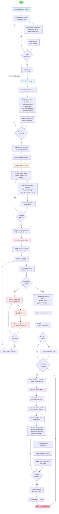

```mermaid
flowchart TD
    Start([Start]) --> AB[Assessment Brief Creation]
    
    AB --> AB1[Module Leader creates<br/>assessment brief]
    AB1 --> AB2[Fill in module information,<br/>assessment details,<br/>learning outcomes]
    AB2 --> AB3[Assign Internal<br/>Peer Reviewer]
    AB3 --> AB4{Brief<br/>Complete?}
    AB4 -->|No| AB1
    AB4 -->|Yes| AB5[Submit for<br/>Peer Review]
    AB5 --> PR[Peer Review Page]
    
    PR --> PR1[Internal Peer Reviewer<br/>reviews assessment brief]
    PR1 --> PR2[Complete checklist:<br/>- Briefing sheet<br/>- Compliance<br/>- Instructions clarity<br/>- Criteria clarity<br/>- Task appropriateness<br/>- Special provisions]
    PR2 --> PR3[Add comments and<br/>recommendations]
    PR3 --> PR4{Peer Review<br/>Approved?}
    PR4 -->|No - Needs Changes| AB1
    PR4 -->|Yes| PR5[Module Leader signs off<br/>Peer Reviewer signs off]
    PR5 --> PR6[Send to Sample Selection]
    PR6 --> SS[Sample Selection Page]
    
    SS --> SS1[Course Leader selects<br/>student samples after grading]
    SS1 --> SS2[Select representative samples:<br/>- 10% of submissions<br/>- Min 5, Max 15<br/>- Include borderline cases]
    SS2 --> SS3[View student grades<br/>and feedback]
    SS3 --> SS4{Samples<br/>Selected?}
    SS4 -->|No| SS1
    SS4 -->|Yes| SS5[Send to Internal Moderator<br/>📧 Email notification sent]
    SS5 --> IM[Internal Moderation Page]
    
    IM --> IM1[Status: Awaiting Internal<br/>Moderation Review]
    IM1 --> IM2[Internal Moderator<br/>reviews samples]
    IM2 --> IM3[Reviews grades and<br/>feedback comments]
    IM3 --> IM4{Clarification<br/>Needed?}
    
    IM4 -->|Yes| IM5[Request Clarification<br/>from Module Leader]
    IM5 --> IM6[📧 Email sent to<br/>Module Leader]
    IM6 --> IM7[Module Leader responds<br/>to clarification request]
    IM7 --> IM8{Response<br/>Adequate?}
    IM8 -->|No| IM5
    IM8 -->|Yes| IM9[Acknowledge response]
    IM9 --> IM2
    
    IM4 -->|No| IM10[Complete moderation review:<br/>- Assess grade appropriateness<br/>- Add comments/actions]
    IM10 --> IM11[Internal Moderator signs]
    IM11 --> IM12[Module Leader signs<br/>acknowledgement]
    IM12 --> IM13{Franchise<br/>Partner?}
    IM13 -->|Yes| IM14[Franchise Partner signs]
    IM14 --> IM15{External<br/>Moderation<br/>Required?}
    IM13 -->|No| IM15
    
    IM15 -->|No| End([End - Process Complete])
    IM15 -->|Yes| IM16[Send to External Examiner<br/>📧 Email notification sent]
    IM16 --> EE[External Examiner Page]
    
    EE --> EE1[External Examiner<br/>receives notification]
    EE1 --> EE2[View assessment details<br/>and moderated samples]
    EE2 --> EE3[Review student work<br/>and feedback]
    EE3 --> EE4[Answer review questions:<br/>1. Assessment alignment<br/>2. Standards consistency<br/>3. Recommendations]
    EE4 --> EE5[Provide additional comments]
    EE5 --> EE6[Mark review as complete]
    EE6 --> EE7[External Examiner signs<br/>and dates]
    EE7 --> EE8{Review<br/>Complete?}
    EE8 -->|No| EE4
    EE8 -->|Yes| EE9[Submit External<br/>Examiner Report]
    EE9 --> EE10[Download PDF Report]
    EE10 --> End
    
    style Start fill:#90EE90
    style End fill:#FFB6C1
    style AB fill:#E6F3FF
    style PR fill:#E6F3FF
    style SS fill:#FFF9E6
    style IM fill:#FFE6F0
    style EE fill:#F0E6FF
    style IM5 fill:#FFE6E6
    style IM6 fill:#FFE6E6
    style IM7 fill:#FFE6E6
```
