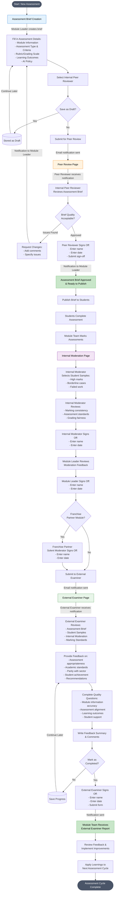

```mermaid

```mermaid
flowchart TD
    Start([Start: New Assessment]) --> Brief[Assessment Brief Creation]
    
    Brief --> |Module Leader creates brief| FillBrief[Fill in Assessment Details:<br/>- Module Information<br/>- Assessment Type & Criteria<br/>- Rubric/Grading Scale<br/>- Learning Outcomes<br/>- AI Policy]
    
    FillBrief --> SelectReviewer[Select Internal Peer Reviewer]
    SelectReviewer --> SaveDraft{Save as Draft?}
    SaveDraft --> |Yes| Draft[(Stored as Draft)]
    Draft --> |Continue Later| FillBrief
    SaveDraft --> |No| SubmitPR[Submit for Peer Review]
    
    SubmitPR --> |Email notification sent| PeerReview[Peer Review Page]
    
    PeerReview --> |Peer Reviewer receives notification| ReviewBrief[Internal Peer Reviewer<br/>Reviews Assessment Brief]
    
    ReviewBrief --> CheckBrief{Brief Quality<br/>Acceptable?}
    
    CheckBrief --> |Issues Found| RequestChanges[Request Changes:<br/>- Add comments<br/>- Specify issues]
    RequestChanges --> |Notification to Module Leader| FillBrief
    
    CheckBrief --> |Approved| SignOffPeer[Peer Reviewer Signs Off:<br/>- Enter name<br/>- Enter date<br/>- Submit sign-off]
    
    SignOffPeer --> |Notification to Module Leader| BriefApproved[Assessment Brief Approved<br/>& Ready to Publish]
    
    BriefApproved --> PublishStudents[Publish Brief to Students]
    PublishStudents --> StudentsWork[Students Complete Assessment]
    StudentsWork --> Marking[Module Team Marks Assessments]
    
    Marking --> InternalMod[Internal Moderation Page]
    
    InternalMod --> SelectSamples[Internal Moderator<br/>Selects Student Samples:<br/>- High marks<br/>- Borderline cases<br/>- Failed work]
    
    SelectSamples --> ModeratorReview[Internal Moderator Reviews:<br/>- Marking consistency<br/>- Assessment standards<br/>- Grading fairness]
    
    ModeratorReview --> ModeratorSign[Internal Moderator Signs Off:<br/>- Enter name<br/>- Enter date]
    
    ModeratorSign --> ModuleLeaderReview[Module Leader Reviews<br/>Moderation Feedback]
    
    ModuleLeaderReview --> MLSign[Module Leader Signs Off:<br/>- Enter name<br/>- Enter date]
    
    MLSign --> FranchiseCheck{Franchise<br/>Partner Module?}
    
    FranchiseCheck --> |Yes| FPSign[Franchise Partner<br/>Solent Moderator Signs Off:<br/>- Enter name<br/>- Enter date]
    FranchiseCheck --> |No| SubmitEE[Submit to External Examiner]
    FPSign --> SubmitEE
    
    SubmitEE --> |Email notification sent| ExternalExam[External Examiner Page]
    
    ExternalExam --> |External Examiner receives notification| EEReview[External Examiner Reviews:<br/>- Assessment Brief<br/>- Student Samples<br/>- Internal Moderation<br/>- Marking Standards]
    
    EEReview --> EEFeedback[Provide Feedback on:<br/>- Assessment appropriateness<br/>- Academic standards<br/>- Parity with sector<br/>- Student achievement<br/>- Recommendations]
    
    EEFeedback --> EEQuestions[Complete Quality Questions:<br/>- Module information accuracy<br/>- Assessment alignment<br/>- Learning outcomes<br/>- Student support]
    
    EEQuestions --> EESummary[Write Feedback Summary<br/>& Comments]
    
    EESummary --> EEComplete{Mark as<br/>Completed?}
    
    EEComplete --> |No| SaveEEDraft[(Save Progress)]
    SaveEEDraft --> |Continue Later| EEFeedback
    
    EEComplete --> |Yes| EESignOff[External Examiner Signs Off:<br/>- Enter name<br/>- Enter date<br/>- Submit form]
    
    EESignOff --> |Notification sent| ModuleTeam[Module Team Receives<br/>External Examiner Report]
    
    ModuleTeam --> Review[Review Feedback &<br/>Implement Improvements]
    
    Review --> NextCycle[Apply Learnings to<br/>Next Assessment Cycle]
    
    NextCycle --> End([Assessment Cycle Complete])
    
    style Start fill:#4a5568,stroke:#2d3748,color:#fff
    style Brief fill:#e3f2fd,stroke:#1976d2,color:#000
    style PeerReview fill:#fff3e0,stroke:#f57c00,color:#000
    style InternalMod fill:#f3e5f5,stroke:#7b1fa2,color:#000
    style ExternalExam fill:#e8f5e9,stroke:#388e3c,color:#000
    style End fill:#4a5568,stroke:#2d3748,color:#fff
    style BriefApproved fill:#c8e6c9,stroke:#4caf50,color:#000
    style ModuleTeam fill:#c8e6c9,stroke:#4caf50,color:#000
```

    ```