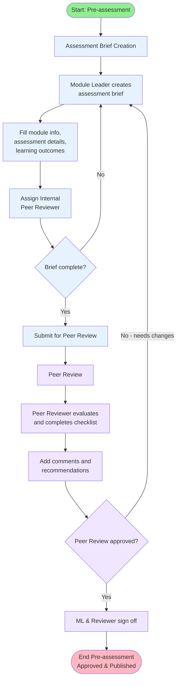
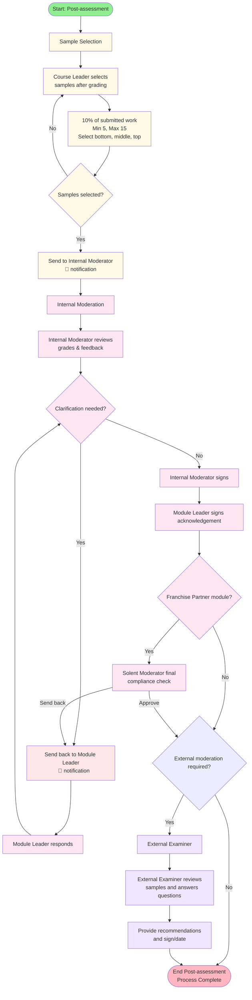

## Workflow Stages Overview

### 1. **Assessment Brief Creation** (Module Leader)
- Create and configure assessment details
- Set learning outcomes and AI guidance
- Assign internal peer reviewer
- Submit for peer review

### 2. **Peer Review** (Internal Peer Reviewer)
- Review assessment brief against quality criteria
- Complete compliance checklist
- Provide feedback and recommendations
- Sign off (both reviewer and module leader)

### 3. **Sample Selection** (Course Leader)
- Select representative student samples after grading
- Ensure 10% coverage with borderline cases
- Review is prepared for Internal Moderator
- Send to Internal Moderator with email notification

### 4. **Internal Moderation** (Internal Moderator + Module Leader + Solent Moderator)
- Internal Moderator reviews selected samples (post-grading)
- Can request clarification from Module Leader (iterative loop)
- Module Leader responds to clarification requests
- Complete moderation review with sign-offs
- If Franchise Partner module: Solent Moderator performs final compliance moderation (can approve or send back to franchise/module leader)
- Decision: Send to External Examiner or complete

### 5. **External Examiner Review** (External Examiner)
- Review assessment and student samples
- Answer structured review questions
- Provide feedback and recommendations
- Sign off and submit final report
- Download PDF for records

## Key Decision Points

- **Brief Complete?** - Ensures all required fields are filled
- **Peer Review Approved?** - Determines if brief needs revision
- **Samples Selected?** - Validates sample selection is complete
- **Clarification Needed?** - Triggers iterative communication loop
- **Franchise Partner?** - Adds Solent Moderator compliance step (approve or send back to franchise/module leader)
- **External Moderation Required?** - Routes to External Examiner or ends process
- **Review Complete?** - Final validation before submission

## Email Notifications

📧 Email notifications are sent at key handoff points:
- Sample Selection → Internal Moderator
- Request Clarification → Module Leader
- Internal Moderation → External Examiner

## Data Flow

All pages share the same `AssessmentData` state, ensuring:
- Module information propagates across all pages
- Student samples are consistent
- Sign-offs are tracked
- Clarification history is maintained

## State Read/Write Map

- Assessment Brief Creation
    - Reads: `peerReviewSignedOff`
    - Writes: `moduleTitle`, `moduleCode`, `moduleLeader`, `level`, `assessmentTitle`, `assessmentNumber`, `assessmentType`, `mustPass`, `restrictions`, `consequenceOption`, `individualGroup`, `groupMarking`, `assessmentWeighting`, `issueDate`, `handInDate`, `plannedFeedbackDate`, `modeOfSubmission`, `anonymousMarking`, `assessmentTask`, `assessmentCriteria`, `aiGuidance`, `aiPolicy`, `learningOutcomes`, `livingCV1`, `livingCV2`, `internalPeerReviewer`

- Peer Review (Module Leader / Peer Reviewer / ML Sent Back / ML Signed Off)
    - Reads: brief fields listed above
    - Writes: `peerReviewComments`, `peerReviewChecks`, `moduleLeaderComments`, `peerReviewerOverallComments`, `moduleLeaderResponseToReviewer`, `passGrade`, `aggregated`, `peerReviewSignedOff`, `peerReviewSentBack`, `moduleLeaderSignature`, `peerReviewDate`, `peerReviewerDate`

- Sample Selection
    - Reads: `moduleTitle`, `moduleCode`, `moduleLeader`, `level`, `academicYear`, `semester`
    - Writes: `internalModeratorName` (on send); optionally uses local `studentSamples`

- Internal Moderation (Moderator / ML Sent Back / ML Signed Off)
    - Reads: `studentSamples` and module info
    - Writes: `gradesAppropriate`, `additionalComments`, `moduleLeaderResponse`, `internalModeratorName`, `internalModeratorDate`, `moduleLeaderSignName`, `moduleLeaderSignDate`, `franchisePartnerName`, `franchisePartnerDate`, `isFranchisePartner`, `requiresExternalModeration`, `internalModerationComplete`, `internalModerationStatus`, `internalModerationMLResponse`
    - Solent Moderator view additionally writes: `solentModeratorComments`

- External Examiner
    - Reads: module info and samples
    - Current implementation: manages `externalExaminerSignature` and `externalExaminerDate` locally inside `FeedbackForm` (not persisted to `AssessmentData` yet); submission toggles a local `isSubmitted` state.

## Navigation Triggers

- `onNavigate('peer-review')`: From Assessment Brief to Peer Review
- `onNavigate('sample-selection')`: Top-tab navigation; flow proceeds after Peer Review
- `onNavigate('internal-moderation')`: From Sample Selection “Send to Moderator”
- `onNavigate('feedback')`: Top-tab navigation; typically after Internal Moderation

All navigation is handled by `App.tsx` via a single `currentPage` state—no URL routing.