# LMS Assessment Workflow - Complete Process Flow

This document provides a comprehensive overview of the entire assessment workflow across all pages and views in the Learning Management System.

## Workflow Overview

The system implements **TWO DISTINCT WORKFLOWS** that occur at different points in the academic lifecycle:

### **Workflow A: Pre-Assessment (Before Student Work)**
Assessment Brief Creation → Peer Review → Approval

This workflow occurs **before students begin their work**. It ensures the assessment design is appropriate, meets academic standards, and is properly reviewed.

### **Workflow B: Post-Assessment (After Student Work is Marked)**
Sample Selection → Internal Moderation → External Examination

This workflow occurs **after students have completed the semester, submitted work, and had it marked**. It ensures marking consistency, grading standards, and academic quality assurance.

---

## Workflow A: Pre-Assessment Process (Assessment Design & Approval)

### Timeline
**Occurs: Before semester begins / Before students start work**

### Flowchart - Pre-Assessment Workflow


### Pre-Assessment Stages

#### **Stage 1: Assessment Brief Creation**
- **Actor:** Module Leader (ML)
- **Timing:** Before semester begins
- **Purpose:** Design and document the assessment
- **Key Actions:**
  - Fill in module information (code, title, level, etc.)
  - Define assessment type and requirements
  - Set learning outcomes
  - Upload assessment brief document
  - Submit for peer review

#### **Stage 2: Peer Review** (4 Views)

**2.1 Peer Reviewer View**
- **Actor:** Peer Reviewer
- **Timing:** After ML submits brief
- **Purpose:** Quality assurance of assessment design
- **Key Actions:**
  - Review assessment brief for appropriateness
  - Check alignment with learning outcomes
  - Verify academic standards
  - Answer review questions
  - **Decision:** Approve OR Send back for amendment

**2.2 ML: Sent Back for Amendment** (Yellow Theme)
- **Actor:** Module Leader
- **Timing:** If peer reviewer requests changes
- **Purpose:** Address peer reviewer concerns
- **Key Actions:**
  - Read peer reviewer feedback
  - Revise assessment brief
  - Make necessary amendments
  - Respond to comments
  - Resubmit amended brief

**2.3 ML: Resubmitted** (Blue Theme)
- **Actor:** Peer Reviewer (re-reviewing)
- **Timing:** After ML resubmits
- **Purpose:** Verify amendments address feedback
- **Key Actions:**
  - Review changes made by ML
  - Verify concerns addressed
  - **Decision:** Approve OR Send back again

**2.4 ML: Signed Off** (Green Theme)
- **Actor:** Module Leader (viewing approval)
- **Timing:** After peer approval
- **Purpose:** Confirmation and proceed with semester
- **Key Actions:**
  - View peer reviewer approval
  - Download approved brief
  - **Assessment is now approved for use in semester**

---

## Workflow B: Post-Assessment Process (Marking Quality Assurance)

### Timeline
**Occurs: After semester ends, work is submitted and marked**

### Flowchart - Post-Assessment Workflow


### Post-Assessment Stages

#### **Stage 3: Sample Selection**
- **Actor:** Module Leader
- **Timing:** After all student work is marked
- **Purpose:** Select representative samples for quality review
- **Key Actions:**
  - Review complete list of student submissions
  - Select samples across grade ranges (high, middle, low, borderline)
  - Ensure representative sample of marking
  - Assign Internal Moderator
  - Submit for internal moderation

#### **Stage 4: Internal Moderation** (3 Views)

**4.1 Internal Moderator View** (Blue Theme)
- **Actor:** Internal Moderator (IM)
- **Timing:** After samples selected
- **Purpose:** Review marking consistency and standards
- **Key Actions:**
  - Review selected student work samples
  - Check marking against criteria
  - Assess grading appropriateness
  - Verify feedback quality
  - Provide feedback on marking
  - **Decision:** Approve OR Request clarification

**4.2 ML: Sent Back for Clarification** (Yellow Theme)
- **Actor:** Module Leader
- **Timing:** If IM has questions
- **Purpose:** Respond to moderator concerns about marking
- **Key Actions:**
  - Read moderator's questions about marking decisions
  - Provide detailed clarification on grading rationale
  - Address any grading inconsistencies
  - Explain borderline cases
  - Resubmit response

**4.3 ML: Signed Off** (Green Theme)
- **Actor:** Module Leader & Internal Moderator
- **Timing:** After IM satisfied with marking
- **Purpose:** Internal approval of marking standards
- **Key Actions:**
  - IM reviews ML clarification (if needed)
  - IM signs off internal moderation
  - ML countersigns approval
  - Proceed to external examination

#### **Stage 5: External Examiner** (2 Views)

**5.1 External Examiner View** (Purple Theme)
- **Actor:** External Examiner (EE)
- **Timing:** After internal moderation complete
- **Purpose:** Independent validation of academic standards
- **Key Actions:**
  - Review student sample work and grades
  - Review marking and feedback
  - Review internal moderation documentation
  - Compare standards to other UK institutions
  - Answer assessment questions
  - Provide comprehensive feedback
  - Sign and submit report

**5.2 Course Leader: Completed Report** (Blue/Green Theme)
- **Actor:** Course Leader / Module Leader
- **Timing:** After EE submits report
- **Purpose:** Final review and acknowledgment
- **Key Actions:**
  - Review complete External Examiner report
  - View all submitted responses and feedback
  - Download complete PDF report
  - Acknowledge receipt
  - **Complete post-assessment quality assurance**

---

## Complete Academic Cycle


---

## Timeline Visualization


---

## Use Case Diagram - Workflow A: Pre-Assessment

```mermaid
graph TB
    subgraph WorkflowA["Workflow A: Pre-Assessment Design & Approval"]
        subgraph Brief["Assessment Brief Management"]
            UC1[Create Assessment Brief]
            UC2[Edit Assessment Details]
            UC3[Upload Brief Document]
            UC4[Submit for Peer Review]
        end
        
        subgraph PeerRev["Peer Review Management"]
            UC5[Review Assessment Brief]
            UC6[Provide Peer Feedback]
            UC7[Approve Assessment Brief]
            UC8[Request Amendments]
            UC9[Respond to Peer Feedback]
            UC10[Resubmit Amended Brief]
            UC11[View Peer Approval]
        end
    end
    
    %% Actors for Workflow A
    ML_A[👤 Module Leader<br/>Pre-Assessment]
    PR[👤 Peer Reviewer]
    
    %% Module Leader connections - Workflow A
    ML_A -.->|performs| UC1
    ML_A -.->|performs| UC2
    ML_A -.->|performs| UC3
    ML_A -.->|performs| UC4
    ML_A -.->|performs| UC9
    ML_A -.->|performs| UC10
    ML_A -.->|performs| UC11
    
    %% Peer Reviewer connections
    PR -.->|performs| UC5
    PR -.->|performs| UC6
    PR -.->|performs| UC7
    PR -.->|performs| UC8
    
    %% Styling
    classDef actor fill:#4a5568,stroke:#2d3748,stroke-width:3px,color:#fff
    classDef usecase fill:#e3f2fd,stroke:#1976d2,stroke-width:2px
    
    class ML_A,PR actor
    class UC1,UC2,UC3,UC4,UC5,UC6,UC7,UC8,UC9,UC10,UC11 usecase
```



---

## Use Case Diagram - Workflow B: Post-Assessment

```mermaid
graph TB
    subgraph WorkflowB["Workflow B: Post-Assessment Quality Assurance"]
        subgraph Sample["Sample Selection Management"]
            UC12[View Marked Submissions]
            UC13[Select Student Samples]
            UC14[Assign Internal Moderator]
            UC15[Submit for Internal Moderation]
        end
        
        subgraph IntMod["Internal Moderation Management"]
            UC16[Review Student Samples]
            UC17[Assess Marking Standards]
            UC18[Provide Moderation Feedback]
            UC19[Request Clarification]
            UC20[Respond to Clarification Request]
            UC21[Sign Off Internal Moderation]
            UC22[Countersign Moderation]
        end
        
        subgraph ExtExam["External Examination Management"]
            UC23[Review Marked Work]
            UC24[Review Internal Moderation]
            UC25[Answer Assessment Questions]
            UC26[Provide External Feedback]
            UC27[Submit External Report]
            UC28[View Completed Report]
            UC29[Download Complete PDF]
            UC30[Acknowledge Report Receipt]
        end
        
        subgraph Common["Common Functions"]
            UC31[Navigate Between Pages]
            UC32[View Workflow Status]
            UC33[Download Documents]
            UC34[View Audit Trail]
        end
    end
    
    %% Actors for Workflow B
    ML_B[👤 Module Leader<br/>Post-Assessment]
    IM[👤 Internal Moderator]
    EE[👤 External Examiner]
    CL[👤 Course Leader]
    
    %% Module Leader connections - Workflow B
    ML_B -.->|performs| UC12
    ML_B -.->|performs| UC13
    ML_B -.->|performs| UC14
    ML_B -.->|performs| UC15
    ML_B -.->|performs| UC20
    ML_B -.->|performs| UC22
    ML_B -.->|performs| UC31
    ML_B -.->|performs| UC32
    ML_B -.->|performs| UC33
    ML_B -.->|performs| UC34
    
    %% Internal Moderator connections
    IM -.->|performs| UC16
    IM -.->|performs| UC17
    IM -.->|performs| UC18
    IM -.->|performs| UC19
    IM -.->|performs| UC21
    IM -.->|performs| UC31
    IM -.->|performs| UC32
    
    %% External Examiner connections
    EE -.->|performs| UC23
    EE -.->|performs| UC24
    EE -.->|performs| UC25
    EE -.->|performs| UC26
    EE -.->|performs| UC27
    EE -.->|performs| UC31
    EE -.->|performs| UC33
    
    %% Course Leader connections
    CL -.->|performs| UC28
    CL -.->|performs| UC29
    CL -.->|performs| UC30
    CL -.->|performs| UC31
    CL -.->|performs| UC32
    CL -.->|performs| UC34
    
    %% Styling
    classDef actor fill:#4a5568,stroke:#2d3748,stroke-width:3px,color:#fff
    classDef usecase fill:#e8f5e9,stroke:#388e3c,stroke-width:2px
    
    class ML_B,IM,EE,CL actor
    class UC12,UC13,UC14,UC15,UC16,UC17,UC18,UC19,UC20,UC21,UC22,UC23,UC24,UC25,UC26,UC27,UC28,UC29,UC30,UC31,UC32,UC33,UC34 usecase
```



---

## Actor Roles Across Both Workflows

| Actor | Workflow A: Pre-Assessment | Workflow B: Post-Assessment |
|-------|---------------------------|----------------------------|
| **Module Leader** | • Create assessment brief<br>• Respond to peer feedback<br>• Revise brief based on feedback<br>• Submit for approval | • Select student samples from marked work<br>• Assign internal moderator<br>• Respond to moderation queries<br>• Countersign moderation approval |
| **Peer Reviewer** | • Review assessment design<br>• Provide feedback on brief<br>• Approve or request amendments<br>• Review resubmissions | *Not involved in Workflow B* |
| **Internal Moderator** | *Not involved in Workflow A* | • Review marked student samples<br>• Assess marking consistency<br>• Request clarifications on grading<br>• Sign off moderation |
| **External Examiner** | *Not involved in Workflow A* | • Review marked work samples<br>• Review internal moderation<br>• Validate academic standards<br>• Submit final report |
| **Course Leader** | *Not involved in Workflow A* | • Review completed external report<br>• Download complete documentation<br>• Acknowledge receipt<br>• Close quality assurance process |

---

## Key Differences Between Workflows

| Aspect | Workflow A: Pre-Assessment | Workflow B: Post-Assessment |
|--------|---------------------------|----------------------------|
| **Timing** | Before semester / Before student work begins | After semester / After work is marked |
| **Focus** | Assessment design and appropriateness | Marking quality and standards |
| **Input** | Assessment brief document | Marked student work samples |
| **Primary Quality Check** | Peer review of assessment design | Internal & external moderation of marking |
| **Actors Involved** | Module Leader, Peer Reviewer | Module Leader, Internal Moderator, External Examiner, Course Leader |
| **Outcome** | Approved assessment ready for use | Quality-assured marking with external validation |
| **Pages Used** | Pages 1-2 (Brief Creation, Peer Review) | Pages 3-5 (Sample Selection, Internal Moderation, External Examiner) |
| **Duration** | Typically 1-2 weeks | Typically 3-4 weeks |
| **Frequency** | Once before semester | Once after marking complete |

---

## System Interaction Patterns

### **Workflow A Pattern: Assessment Design Approval**
```
Module Leader → Create Brief → Submit → 
Peer Reviewer → Review → 
  [If concerns] → Request Amendments → Module Leader → Revise → Resubmit → Peer Reviewer
  [If satisfied] → Approve → 
Ready for Semester
```

### **Workflow B Pattern 1: Internal Moderation Loop**
```
Module Leader → Select Samples → Submit → 
Internal Moderator → Review Marking → 
  [If questions] → Request Clarification → Module Leader → Respond → Internal Moderator
  [If satisfied] → Sign Off → 
Proceed to External Examination
```

### **Workflow B Pattern 2: External Examination**
```
External Examiner → Review Work & Moderation → 
Answer Questions → Provide Feedback → Submit Report → 
Course Leader → Review → Acknowledge → 
Process Complete
```

---

## Summary Statistics

### Overall System
- **Total Workflows:** 2 (separate processes)
- **Total Pages:** 5
- **Total Views:** 12
- **Total Actors:** 5
- **Total Use Cases:** 34

### Workflow A: Pre-Assessment
- **Pages:** 2 (Assessment Brief Creation, Peer Review)
- **Views:** 4 (Default, Sent Back, Resubmitted, Signed Off)
- **Actors:** 2 (Module Leader, Peer Reviewer)
- **Use Cases:** 11
- **Decision Points:** 2
- **Feedback Loops:** 1 (Peer Review loop)

### Workflow B: Post-Assessment
- **Pages:** 3 (Sample Selection, Internal Moderation, External Examiner)
- **Views:** 8 (including all moderation and examiner views)
- **Actors:** 4 (Module Leader, Internal Moderator, External Examiner, Course Leader)
- **Use Cases:** 23
- **Decision Points:** 4
- **Feedback Loops:** 1 (Internal Moderation loop)

---

## Critical Understanding

⚠️ **Important:** These are **two separate quality assurance processes** at different points in the academic cycle:

1. **Workflow A** ensures the assessment is well-designed **before** students attempt it
2. A temporal gap exists (the semester) where students complete their work
3. **Workflow B** ensures the marking is consistent and meets standards **after** work is completed

The workflows are **independent but complementary** - both are necessary for complete academic quality assurance.

---

## Franchise Partner Moderation Flow (Workflow B Variant)

### When Franchise Partner Route is Activated
When "This module is for a Franchise Partner" is **checked** during Internal Moderation, the workflow includes an additional approval step by the **Solent Moderator Franchise Partner**.

### Franchise Partner Workflow Stages

#### **Stage 1: Internal Moderator Signs Off**
- **Actor:** Internal Moderator
- **Action:** Reviews samples and completes internal moderation form
- **Decision:** 
  - **Sign Off:** Routes to Franchise Partner Sign Off view (new step)
  - **Send Back:** Routes to Module Leader with feedback (unchanged)

#### **Stage 2: Solent Moderator Franchise Partner Sign Off** ⭐ NEW VIEW
- **Component:** `SolentModeratorFranchisePartnerSignOff.tsx`
- **Actor:** Solent Moderator (acting on behalf of Franchise Partner)
- **Timing:** After internal moderator signs off a franchise partner module
- **Purpose:** Final approval from Solent for franchise partner modules
- **Key Actions:**
  - Review student samples and internal moderation assessment
  - Verify grades are appropriate for franchise partner standards
  - Sign off with name and date
  - **Decision Options:**
    - ✅ **Send to External Examiner** - Module approved and ready for external review
    - ↩️ **Send Back to Internal Moderator** - Request further review or changes

#### **Stage 3: Module Leader Confirmation** (unchanged)
- **View:** ML: Sign Off
- **Actor:** Module Leader
- **Purpose:** Final confirmation that all moderation is complete
- **Next Step:** External Examiner Feedback

### Franchise Partner Flow Diagram

```mermaid
flowchart TD
    IM["Internal Moderator<br/>Completes Moderation"] --> FP{Is Franchise<br/>Partner?}
    
    FP -->|No| MLSO["Module Leader<br/>Sign Off View<br/>(ML: Sign Off)"]
    FP -->|Yes| FPSO["⭐ Solent Moderator<br/>Franchise Partner<br/>Sign Off View"]
    
    FPSO --> FPDEC{Franchise Partner<br/>Decision}
    FPDEC -->|Approve| MLSO
    FPDEC -->|Send Back| SENDBACK["Send Back to<br/>Internal Moderator"]
    SENDBACK --> IM
    
    MLSO --> EEV["External Examiner<br/>View"]
    
    classDef fpStyle fill:#fff8e1,stroke:#ffa726,stroke-width:3px
    classDef newStyle fill:#ffeb3b,stroke:#f57f17,stroke-width:3px
    class FPSO newStyle
    class FP fpStyle
```



### Key Data Flow for Franchise Partners
1. **Franchise Partner Flag:** `assessmentData.isFranchisePartner` (boolean)
2. **Franchise Partner Name:** `assessmentData.franchisePartnerName` (string)
3. **Franchise Partner Date:** `assessmentData.franchisePartnerDate` (date)
4. **Sign-Off Table Row:** "Signed Solent Moderator Franchise Partners ONLY" appears in Internal Moderation form
5. **Calendar Date Picker:** Date field includes `type="date"` calendar selector

### Routing Logic
- **Internal Moderation → Check `formData.isFranchisePartner`**
  - If true and moderator signs off: Route to `'franchise-partner-sign-off'` view
  - If false and moderator signs off: Route to `'ml-signed-off'` view (existing flow)
  - If moderator sends back: Route to `'ml-sent-back'` view (existing flow)

---

*This documentation ensures clear separation between pre-assessment design approval and post-assessment marking quality assurance, with special handling for franchise partner modules.*
